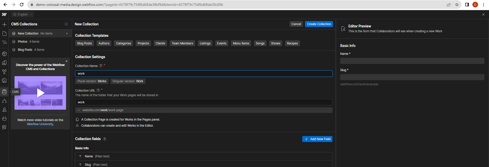
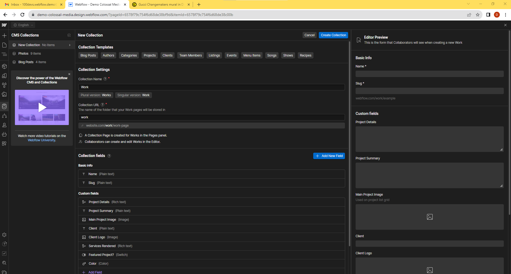

# Colossalmedia Demo Template Using Webflow

[Visit the Current DEMO](https://demo-colossal-media.webflow.io/)

**Important Note:** Webflow is primarily designed as a low to no-code platform. It appears to handle version control through a feature that enables reverting to previous states. Please take into consideration potential limitations on the number of collaborators (ranging from 0 to 10), and be prepared for a distinct collaboration experience compared to GitHub or other Git-based platforms.

"If you add a CMS site plan or Standard Ecommerce site plan to a site within your Workspace, you can invite up to 3 content editors to your site. If you add a Business site plan or Ecommerce Plus or Advanced site plan to a site within your Workspace, you can invite up to 10 content editors to your site."

Table of contents:

1. [**Introduction**](#introduction)
   - Adding Content Editors to Your Site
   - Viewing Teammates in the Designer

2. [**Keeping Link Structure from WP Site**](#keeping-link-structure-from-wp-site)
   - Webflow CMS Collection Menu
   - Projects Template

3. [**Brief Guide to Recreating Colossalmedia's Website Using Webflow's CMS Collections**](#brief-guide-to-recreating-colossalmedias-website-using-webflows-cms-collections)
   1. Create CMS Collections
   2. Design CMS Templates
   3. Set Up Collection Pages
   4. Populate the Collections
   5. Create Navigation
   6. Publish Your Website

4. [**Notes for Creating Something Similar with Current DEMO Link**](#notes-for-creating-something-similar-with-current-demo-link)
   - Current DEMO link
   - Newport Free Photography Template

5. [**WordPress to Webflow Migration: A Step-by-Step Guide**](#wordpress-to-webflow-migration-a-step-by-step-guide)
   - Migration Guidance from Wordpress to Webflow
   - Exporting Content from WordPress
   - Importing Content into Webflow

6. [**Key Features and Functionalities: A Brief Overview**](#key-features-and-functionalities-a-brief-overview)
   - Contact Form for Service Inquiries
   - Personalized Content Suggestions for Visitors
   - Search and Filter Features for Case Studies and Field Notes
   - Responsive Web Design
   - Video Hosting and Gallery Capabilities
   - Newsletter Integration
   - Google Analytics Integration

7. [**WordPress to Webflow Migration Timeline**](#migrating-wordpress-to-webflow---a-timeline)
   - Overview of the Migration Process
   - Assessing Website Complexity and its Impact
   - Strategies for Efficient Content Transfer
   - Implementing Webflow Design Elements
   - Managing DNS and Domain Update Downtime
   - Importance of Comprehensive Testing
   - Ensuring SEO Stability During Migration
   - SSL Certificate Setup in Webflow
   - Developing a Robust Backup and Contingency Plan
   - Conclusion: Estimating Migration Timeframes and Seeking Professional Assistance

8. [**Expected Downtime - DNS and Domain Configuration**](#expected-downtime---dns-and-domain-configuration)
   - Understanding Downtime during DNS and Domain Configuration
   - Factors Influencing DNS Propagation Time
   - Strategies for Minimizing Service Interruptions
   - Conducting Pre-Switch Testing and Validation
   - Ensuring Smooth Transition to Webflow
   - Conclusion: DNS and Domain Transition Best Practices

---

## Introduction

**Adding Content Editors to Your Site:**

Depending on the site plan you choose within your Workspace, you can invite a specific number of content editors to collaborate on your site. Here are the limits:

- With a CMS site plan or Standard Ecommerce site plan, you can invite up to 3 content editors.

- If you opt for a Business site plan or Ecommerce Plus or Advanced site plan, you can invite up to 10 content editors.

For more details on how to invite content editors, please refer to this [Webflow University lesson](https://university.webflow.com/lesson/invite-content-editors?topics=site-settings).

---

**Viewing Teammates in the Designer:**

To see which of your teammates are actively working on the site alongside you in the Designer, follow these steps:

1. At the top of the Designer, you will notice avatars representing your teammates. Hover over an avatar to reveal their full names and their current activities in the site (whether they are designing or editing), as well as the specific page they are working on.

2. If a number appears on an avatar, click on it to find out which pages your teammates are currently working on.

3. You can also click directly on a teammate's avatar to navigate to the element they have selected.

Additionally:

- You have the option to update your own avatar (profile picture) in your account profile.

- When you are the sole person working on a page, your teammates' avatars will display a number (e.g., 2, 3, 4, etc.) to indicate the number of other teammates currently active on different pages within the site.

For more information on collaboration in the Webflow Designer, please refer to this [Webflow University lesson](https://university.webflow.com/lesson/collaborate-in-the-webflow-designer?topics=layout-design).

---

## Keeping Link Structure from WP Site

In the CMS Collections tab, you can configure a similar link structure with slugs, much like Colossalmedia's site.

The pattern observed on their work page is typically one of two types:
- Work: `https://colossalmedia.com/work/gucci`
- Case-Studies (essentially their blog): `https://colossalmedia.com/case-studies/vans-2023`

The Projects template may be the best option to closely emulate the original site's design.

## Brief Guide to Recreating Colossalmedia's Website Using Webflow's CMS Collections

1. **Create CMS Collections:**
   - Navigate to the CMS Collections tab in your Webflow project.
   - Establish two collections: "Work" and "Case Studies."
   - Include fields such as Title, Slug, Description, etc., in each collection.

2. **Design CMS Templates:**
   - Craft templates for "Work" and "Case Studies" pages, incorporating elements like Title and Description.
   - Utilize the Projects template as a baseline for design, aiming to mirror Colossalmedia's site.

3. **Set Up Collection Pages:**
   - Generate collection pages for "Work" and "Case Studies" in Webflow.
   - Connect these pages to their corresponding CMS collections and templates.
   - Configure the slug field in the collection pages to align with your desired URL structure:
     - For "Work," format the slug as: `/work/{slug}`.
     - For "Case Studies," format the slug as: `/case-studies/{slug}`.

4. **Populate the Collections:**
   - Fill your CMS collections with content, ensuring each entry has a unique slug, title, description, etc.

5. **Create Navigation:**
   - Design a navigation menu linking to "Work" and "Case Studies."
   - Ensure these links direct users to the respective collection pages.

6. **Publish Your Website:**
   - After configuring your CMS collections, templates, and pages, go ahead and publish your site.

By adhering to these guidelines, you can construct a Webflow website that mirrors Colossalmedia's layout, featuring CMS collections for "Work" and "Case Studies," along with templates that replicate the original site's aesthetics. Be sure to tailor the design elements, styles, and interactions to suit your specific needs and vision.

---

### Notes for Creating Something Similar with Current DEMO Link

You can check out the current demo for reference by visiting the following link:

[Current DEMO link](https://demo-colossal-media.webflow.io/)

Newport is a free photography template, expertly crafted to closely resemble an existing website.

For enhanced content management, a new CMS called `Work` can be introduced and linked with unique slugs. In a similar vein, additional CMS collections such as `case-studies` or `field notes` can be developed for diverse content categorization.

## WordPress to Webflow Migration: A Step-by-Step Guide

Migration guidance from Wordpress to Webflow is detailed here: 
[Wordpress to Webflow Migration Guide](https://university.webflow.com/lesson/migrate-from-wordpress-to-webflow-cms?topics=cms-dynamic-content).

WordPress primarily exports content in XML format, but there are numerous plugins that allow exporting in CSV format for specific content types and fields. Despite some plugins being outdated, there are various alternatives, including premium options. Once exported, the CSV files can be effortlessly imported into Webflow.

## Key Features and Functionalities a brief overview:

- **Contact Form for Service Inquiries**: 
  A custom contact form can be designed for service-related queries, ensuring a direct and efficient communication channel with clients. Detailed instructions on creating this feature are available at [Homepage Contact Form Tutorial](https://university.webflow.com/lesson/homepage-contact-form).

- **Personalized Content Suggestions for Visitors**: 
  Implementing personalized content might be feasible with MemberStack, although there is an ongoing debate regarding its implementation. For more insights, visit [Webflow Discourse on Personalized Content](https://discourse.webflow.com/t/displaying-personalised-content/99742/5).

- **Search and Filter Features for Case Studies and Field Notes**:
  Enhancing user experience through dynamic filtering and sorting on case study and field notes pages is possible. Learn how to incorporate these features by visiting [Dynamic Filtering and Sorting Blog](https://webflow.com/blog/dynamic-filtering-and-sorting) and the [Site Search Tutorial](https://university.webflow.com/lesson/site-search?topics=elements).

- **Responsive Web Design**:
  Creating a seamless viewing experience across devices (desktop, tablet, and mobile) is achievable with Webflow's intuitive GUI breakpoints. This ensures optimal display and usability regardless of the device used.

- **Video Hosting and Gallery Capabilities**:
  Self-hosting videos can present challenges, considering external video hosting platforms can lead to improved website performance and a better user experience. It is advisable to explore these options for smoother integration and more efficient management of multimedia content. For further information, you can visit this [Webflow blog post](https://webflow.com/blog/video-hosting-website).

- **Newsletter Integration**:
  The creation and integration of newsletters in Webflow can be complex. The use of tools like MJML, a responsive email framework, offers a potential workaround. However, this might require stepping outside the Webflow ecosystem, as discussed in [Webflow Discourse on Email Newsletters](https://discourse.webflow.com/t/can-you-create-an-email-newsletter-in-webflow/251928). It's important to recognize that Webflow may not be the ideal tool for HTML email campaigns due to limited support in mail clients.

- **Google Analytics Integration**:
  Tracking and analyzing website traffic is crucial, and Google Analytics can be seamlessly integrated with Webflow. This feature allows for comprehensive monitoring of user interactions, providing valuable insights for website optimization. Step-by-step instructions for this setup are provided at [Setting up Google Analytics Tutorial](https://university.webflow.com/lesson/set-up-google-analytics?topics=seo).

## Migrating WordPress to Webflow - A Timeline

Migrating a WordPress website to Webflow and launching it can vary in terms of time and downtime depending on several factors. Here are some considerations:

1. **Complexity of the Website**: The size and complexity of your WordPress website will significantly impact the migration time. A simple blog site might be quicker to migrate than a complex e-commerce site with numerous custom features and plugins.

2. **Content Migration**: Moving your content (posts, pages, images, etc.) from WordPress to Webflow can take time, especially if you have a lot of content. The time required depends on how well-prepared your content is for migration and the method you use to transfer it.

3. **Webflow Design and Development**: You'll need to recreate your WordPress website's design and functionality in Webflow. This may involve designing new templates, layouts, and interactions. The time spent on this depends on the complexity of your design and your familiarity with Webflow.

4. **DNS and Domain Configuration**: Updating DNS settings and configuring your domain to point to the new Webflow website may cause some downtime. The duration of downtime depends on your DNS provider and how quickly changes propagate across the internet, typically a few hours to 48 hours.

5. **Testing**: Thoroughly testing your website on Webflow to ensure that everything works as expected is crucial. This can take some time, especially if you encounter unexpected issues during the migration.

6. **SEO Considerations**: You'll want to make sure that your SEO rankings and traffic are maintained during the migration. Properly setting up 301 redirects and other SEO-related configurations can take time.

7. **SSL Certificate**: Ensure that your SSL certificate is properly configured and active on your Webflow site to maintain security.

8. **Backup and Rollback Plan**: Have a backup and rollback plan in case something goes wrong during the migration. This ensures that you can revert to your old website if needed.

The exact time it takes to migrate and launch a WordPress website on Webflow can vary from a few days to several weeks, depending on the factors mentioned above. To minimize downtime, consider doing the migration and testing on a staging site or subdomain before making the final switch.

Additionally, it's recommended to work with experienced professionals who are familiar with both WordPress and Webflow to ensure a smooth migration and minimize any potential issues.

## Expected Downtime - DNS and Domain Configuration

The overall process of migrating from WordPress to Webflow can indeed be extensive and time-consuming, involving several steps such as assessing the website's complexity, transferring content, recreating design elements, and comprehensive testing. However, the actual downtime experienced during the final 'go-live' phase—when you switch your domain's DNS settings to point to the new Webflow site—is relatively brief.

This downtime is primarily due to DNS propagation, which is the time taken for DNS servers across the internet to update with the new information of your Webflow site. This process typically takes a few hours to 48 hours. During this period, some visitors may be directed to your old WordPress site, while others may see the new Webflow site, depending on their location and their DNS server's update status.

The key to minimizing this downtime is thorough preparation and testing in a staging environment or using a subdomain. By ensuring everything is functioning correctly on Webflow before making the final switch, you can make the transition as smooth as possible and reduce the duration of any potential service interruptions.

[The Webflow docs - Manually connect a custom domain](https://university.webflow.com/lesson/manually-connect-a-custom-domain?topics=hosting-code-export)