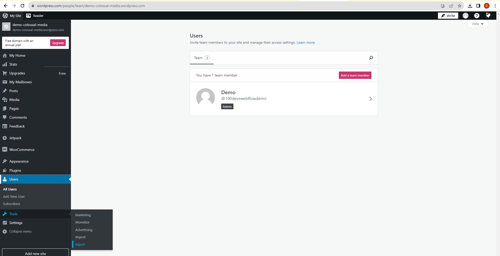
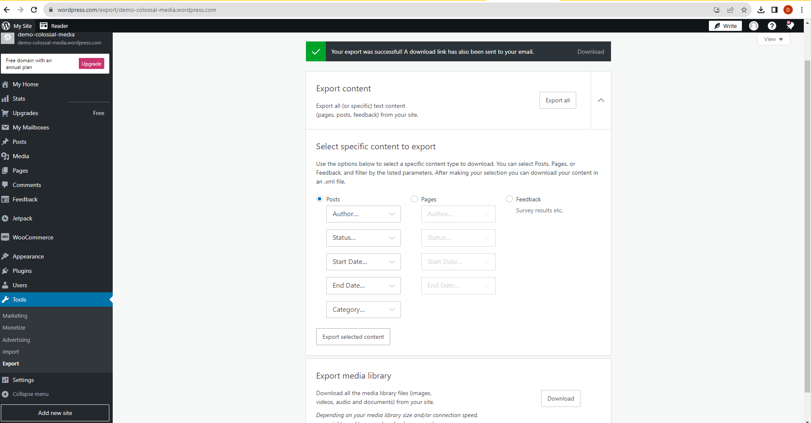
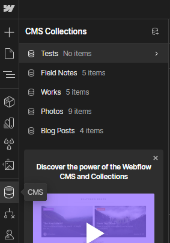
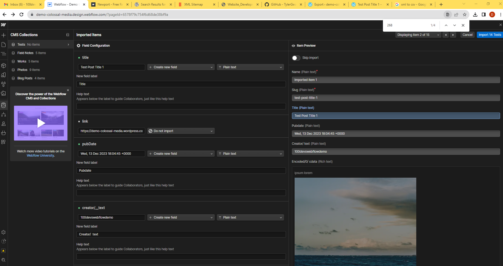

WordPress to Webflow Migration

First I created a WordPress site to test exporting the posts or data to a XML.
This is my demo portfolio site with a blog.
I created a test blog post and then exported the data as XML
https://demo-colossal-media.wordpress.com/2023/12/13/test-post-title-1/

Hovering over Tools > Export

I then selected Export selected content

This allowed me to download the XML file

From there I extracted the zip package and opened the xml file in VSCode
demo-colossal-media.wordpress.2023-12-13.000.xml

I selected all of the content and pasted it into a free online XML to CSV converter as to bypass the need for a paid WP-Plugin
https://www.convertcsv.com/xml-to-csv.htm
I then created a new csv file and pasted the converted data into it
demo-colossal-media.csv

From there I created a new 'Test' CMS collection to import the csv data.

Next I selected the most relevant data items for the Field Configuration.

Most notably I mapped post_name/__text to a Slug

Then Created new fields for:
 Name - Paint Text
 Title - Plain Text
 Pubdate - Plain Text
 Creator/ text - Plain text
 Encoded/0/_cdata - Rich text

 Most notably is the encoded data as rich text as the value includes a paragraph element as well as an image with the wordpress image hosting link with src.

