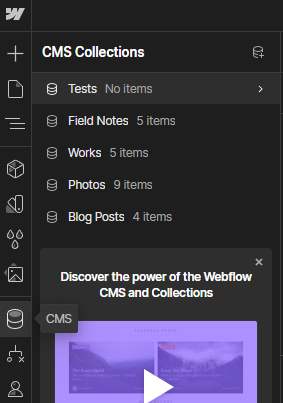
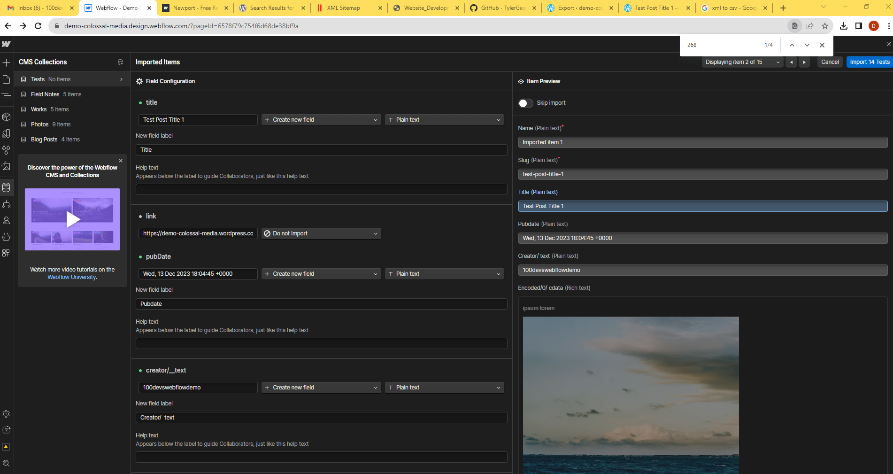
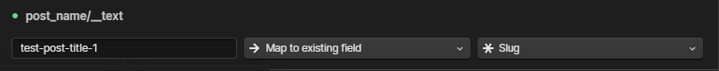

# WordPress to Webflow Migration

To begin the WordPress to Webflow migration process, I followed these steps:

1. **Export WordPress Data as XML**:
   - First, I created a WordPress site, including a demo portfolio site with a blog.
   - I added a test blog post to the WordPress site.
   - To export the data as XML, I used the following URL as an example: [Test Post Title 1](https://demo-colossal-media.wordpress.com/2023/12/13/test-post-title-1/)
   - I accessed the export tool by hovering over **Tools > Export**.
   - 
   - I selected "Export selected content."
   - 
   - This allowed me to download the XML file.
   - 

2. **Convert XML to CSV**:
   - After downloading the XML file, I extracted the zip package and opened the XML file in VSCode (e.g., `demo-colossal-media.wordpress.2023-12-13.000.xml`).
   - I selected all of the XML content and pasted it into a free online XML to CSV converter to avoid the need for a paid WordPress plugin. I used the [XML to CSV Converter](https://www.convertcsv.com/xml-to-csv.htm).
   - I created a new CSV file and pasted the converted data into it (e.g., `demo-colossal-media.csv`).

3. **Set Up CMS Collection in Webflow**:
   - In Webflow, I created a new 'Test' CMS collection to import the CSV data.
   - 

4. **Configure Fields**:
   - In the CMS collection setup, I selected the most relevant data items for the field configuration.
   - Notably, I mapped `post_name/__text` to a Slug field.
   - I created new fields for:
     - Name - Plain Text
     - Title - Plain Text
     - Pubdate - Plain Text
     - Creator/text - Plain Text
     - Encoded/0/_cdata - Rich Text
   - The encoded data is set as rich text because it contains a paragraph element as well as an image with the WordPress image hosting link with src.
   - 
---
   
**Most notably, I mapped `post_name/__text` to a Slug field.**

---
   - 
---

## Import the 14 Test Items - Next steps

### Creating a Backup for Content

1. **Backup Process**:
   - To ensure data security, I initiated a backup for the content.
   - 
   - The process may take a minute to complete.
   - 
   - Upon completion, a success message, "Import Complete," is displayed.
   - 

2. **Working with CMS Collections**:
   - With the backup in place, we can now work with the new CMS Collections, such as Field Notes, Works, Photos, Blog Posts, and more.
   - 

3. **Building New Pages and Templates**:
   - The next crucial step involves building out the new page and/or CMS template to achieve our intended outcome.

4. **Considerations for Rich Text**:
   - Additional considerations include potentially reworking the Rich Text for image src links, especially if they're moved from the current domain hosting to an external server.
   - We may explore parsing and replacing the `Encoded/0/_cdata - Rich Text` more efficiently in the initial `demo-colossal-media.wordpress.2023-12-13.000.xml` file. However, this depends on the volume of content exported.
   - Special attention may be required for video media as well.
